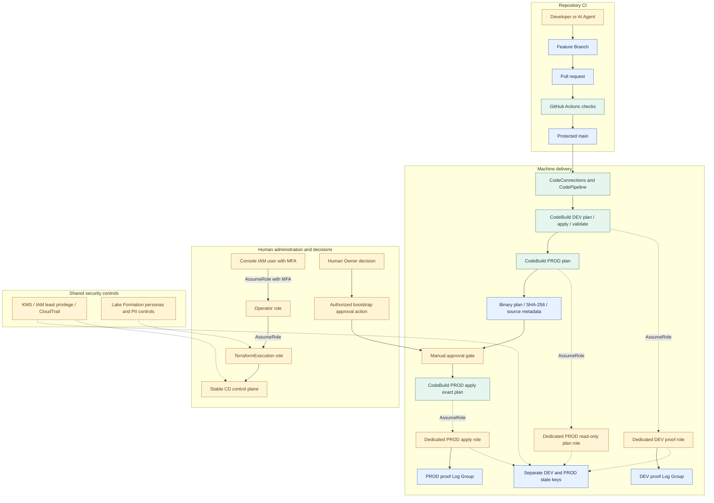

# CI/CD 与安全边界

CI 检查完整仓库；CD 只证明最小 DEV/PROD 发布流程，每个 proof 环境各有一个 CloudWatch Log Group。它不自动部署完整 DEV Lakehouse，也不创建完整 PROD 平台。

GitHub Actions 无 AWS 凭证，执行仓库一致性与凭证检查、Terraform 格式和七个 root 的离线初始化/验证，以及数据、基础设施、ML、RAG 测试。保护分支要求 CI 通过；AWS plan/apply 位于独立 CD。当前工作流并不声称已执行独立 tflint/checkov 扫描或真实 AWS PR plan。

CodeBuild 使用短期服务凭证，各 service role 仅能假设对应的 DEV deploy、PROD plan 或 PROD apply 专用角色。PROD plan 无写 state 和创建资源权限。批准后，apply 校验环境、Git SHA、execution ID、计划 SHA-256 以及获批 hash，再应用原二进制计划；apply 阶段不重新生成获批计划。计划拒绝 delete/replace，发布后核对资源与零漂移。

DEV/PROD proof 是不同 Terraform root 与 state key，共用既有加密状态桶、版本控制和 S3 lockfile；不是两个独立账号或两个状态桶。制品与计划保留 90 天，proof 日志保留 30 天。

人的入口是无访问密钥、无直接项目服务权限的 IAM user，经 MFA → Operator → TerraformExecution 管理获批基础设施；机器不继承这条完整权限链。人工“决定批准”和调用批准 API 是两个环节。当前已部署日常 Human/Operator CLI 权限不应被表述为可常规执行 `PutApprovalResult`；现有 proof 审批采用单独管理的 bootstrap 管理身份，并以 Human Owner 对确切计划的授权为前提。这不授权机器自行批准，也不将 bootstrap 变为日常执行身份。

数据访问另由 Lake Formation persona、IAM、KMS 和 Secrets Manager 控制，CloudTrail 保留审计。图中的治理虚线表示权限边界，不表示 TerraformExecution 自动取得业务数据访问。

依据：[PR 工作流](../../.github/workflows/pull-request-ci.yml)、[CD buildspec](../../buildspecs/v4b-minimal-cd.yml)、[V4B 范围](../v4b-minimal-cd.md)、[治理](../v3-data-governance.md)、[CI/CD 运维手册](../runbooks/monitoring-cicd-operations.md)。
