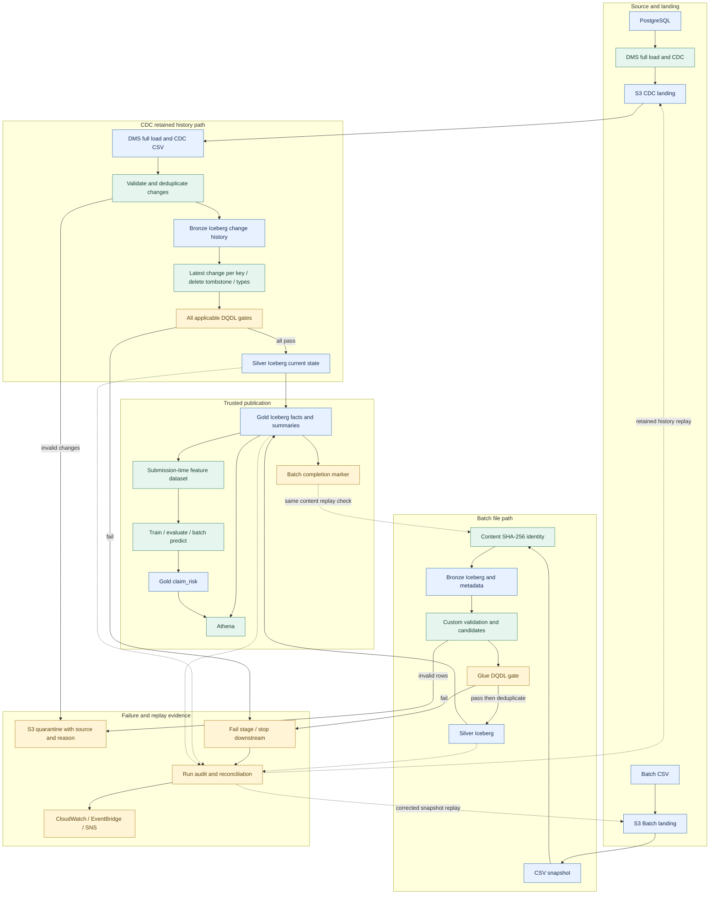

# 数据流与发布边界

两种结构化入口共用 Lakehouse，但各自保留源标识、审计与事实语义。下图展开阶段依赖；Step Functions 为两个入口分别编排 Bronze → Silver → Gold Glue 作业，并提供有界重试与失败捕获。

Batch 使用文件内容 SHA-256 判断已成功发布的输入；相同内容更名上传仍是 `DUPLICATE`。完成标记在 Gold 成功后写入。行级无效数据先进入 quarantine，剩余候选数据通过 DQDL 后才写 Silver；理赔唯一性规则可在最终去重前阻断重复候选。Batch 对账口径为 `input = output + rejected + duplicate`，不同阶段及重复文件 no-op 的计数应结合审计解释。

CDC 在 Bronze 入口验证变更并隔离无效记录，消除精确重复变更；Silver 从保留的历史按业务键、源顺序和稳定变更 ID 重建当前状态，最新删除标记移除对应记录。先规范类型并完成所有适用 DQDL 检查，再开始写 Silver 表。实现使用 Iceberg `createOrReplace`，不是已实现的增量 watermark/MERGE 引擎。其对账是变更日志到当前状态，不能套用 Batch 行数公式。

DQ gate 失败会阻断 Silver 写入和后续 Gold 发布，保留先前可信数据。所有候选先检查降低了质量失败引起的部分更新风险，但多个 Iceberg 表之间没有跨表事务保证；写入途中失败仍须按运行手册核对并重放。源历史保留也是 CDC 重建与恢复的前提。

ML 正式特征排除赔付金额、最终状态、调查结果等事后字段；标签可来自未来合成结果。验收数据使用日期早于理赔提交的单一参考快照，并检查未使用未来参考记录；这不代表实现了多版本参考数据的 as-of join。图中的虚线回放路径由操作员按运行手册触发，不是审计记录自动启动恢复。RAG 文档流见 [最终架构](final-architecture.md)，与本图的结构化事实流分开。

依据：[Batch 实现](../../pipelines/ingestion/batch/glue_claim_pipeline.py)、[CDC 实现](../../pipelines/ingestion/cdc/glue_cdc_pipeline.py)、[V2 数据可靠性](../releases/v2/v2-data-reliability.md)、[V5 重放证据](../releases/v5/v5-runtime-evidence.md)、[数据运维手册](../operations/runbooks/data-pipeline-operations.md)。
