# V1–V6B 演进与验收

V1–V6B 在同一个代码库累积演进。V6 是 SageMaker 托管 ML Pipeline，V6B 是同一版本的 Feature Store 与 Managed MLflow 增强，不是独立产品线。完整 PROD 平台仍未部署；V6/V6B ML 资源仅在 DEV。

```mermaid
flowchart LR
  subgraph build[Functional foundation]
    V1[V1 accepted - Make it work<br/>Batch / CDC / Iceberg<br/>Athena / batch ML / document RAG]
  end
  subgraph harden[Reliability and governance]
    V2[V2 accepted - Make it reliable<br/>Stage gates / DQ / replay<br/>Streaming retired]
    V3[V3 accepted - Make it secure<br/>MFA / role separation<br/>Lake Formation / PII / audit]
  end
  subgraph deliver[Delivery and operations]
    V4[V4 accepted - Automate delivery<br/>Full repository CI<br/>Minimal DEV and PROD CD proof]
    V5[V5 accepted - Make it operable<br/>Alerts / failure recovery<br/>Runbooks / regression / zero drift]
  end
  subgraph mlplatform[Managed ML platform]
    V6[V6 accepted - Managed ML workflow<br/>SageMaker Pipeline / quality gate<br/>Registry / Batch Transform]
    V6B[V6B accepted - Managed feature and tracking<br/>Offline Feature Store<br/>Unified Studio Managed MLflow]
  end
  V1 --> V2 --> V3 --> V4 --> V5 --> V6 --> V6B
  classDef process fill:#e7f5ef,stroke:#398268,color:#173f32;
  classDef control fill:#fff4d6,stroke:#ab8124,color:#594410;
  class V1,V2 process;
  class V3,V4,V5,V6,V6B control;
```

| 版本 | 验收标签 | 关键结果与范围 |
| --- | --- | --- |
| V1 | `v1.0-happy-path` | Batch 与 PostgreSQL full load/CDC 贯通共享 Lakehouse；Athena、120 条批量预测及文档 RAG 得到运行证明。QuickSight 未订阅；历史 Streaming 未贯通。 |
| V2 | `v2.0-reliable` | 明确退役 Streaming；增加分阶段重试、内容身份、去重、DQDL、隔离、审计、对账和恢复。 |
| V3 | `v3.0-governed` | MFA 身份链、职责分离、Lake Formation persona/PII、KMS/Secrets/CloudTrail 与实际 ALLOW/DENY 测试。 |
| V4 | `v4.0-cicd` | 全仓 PR CI 与保护分支；CD 使用专用 proof 角色、独立状态和人工批准的精确计划，DEV/PROD 各仅一个日志组。 |
| V5 | `v5.0-production-ready` | 监控告警、受控失败与恢复、Batch 重复重放、CDC 保留历史重放、安全回归、运行手册和零漂移；集成套件 115/115。 |
| V6 | `v6.0-sagemaker-ml-platform`（最终收口后创建） | 将原有 API 驱动作业迁移为 UI 可见的原生 SageMaker Pipeline；Processing、Training、评估、质量门禁、Model Registry、Batch Transform 与 Gold 发布均由托管 DAG 编排。 |
| V6B | 与 V6 共用标签 | 在同一 Pipeline 中加入离线 Feature Store 写入/读回，并将真实 Pipeline 证据记录到 Unified Studio Managed MLflow；无在线 Feature Store、endpoint 或 PROD ML。 |

V5 实测将负数理赔隔离，修正后的完整快照发布 121 条有效理赔，字节相同重放得到三个阶段的 `DUPLICATE`。CDC 重放暴露并修复类型与 DQ 检查边界问题，随后所有 10 条适用规则通过。该证明没有修改 RDS 源记录或恢复 DMS 任务为持续健康状态。

V6B 验证执行 `zr3k4aa3lzfz` 的 9/9 步骤成功，离线 Feature Store 120/120 条记录写入并读回，Gold 为 120 行、120 个唯一 claim、0 个无效概率。Managed MLflow 只承担实验追踪，最终为 Stopped/Inactive。首次 Small 服务器运行约 14 小时 52 分钟，超过批准的 4 小时窗口，估算约 USD 9.55；这是明确记录的成本控制偏差。

保留的限制是：未配置人工 SNS 订阅、既有 DMS 任务处于失败状态、QuickSight 未启用、无完整 PROD 平台、无实时 ML endpoint。项目保持 AWS FREE 计划与小数据量成本边界；版本验收并不取消这些限制，也不授权 V7 或新资源。

证据入口：[V1 评审](../releases/v1/v1-completion-review.md)、[V2 评审](../releases/v2/v2-completion-review.md)、[V3 评审](../releases/v3/v3-completion-review.md)、[V4B](../releases/v4/v4b-minimal-cd.md)、[V5 评审](../releases/v5/v5-completion-review.md)、[V6 Pipeline](sagemaker-managed-pipeline.md)、[V6B 评审](../releases/v6b/v6b-completion-review.md)。这些文件是阶段性记录，其中早于最终验收的待批准措辞应按时间理解。
