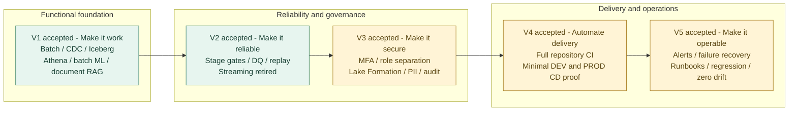

# V1–V5 演进与验收

五个版本在同一个代码库累积演进。最终验收标签 `v5.0-production-ready` 指向 `5e0b479`；“生产就绪”指获批范围内的 DEV 工程与运维证明，完整 PROD 平台仍未部署。

| 版本 | 验收标签 | 关键结果与范围 |
| --- | --- | --- |
| V1 | `v1.0-happy-path` | Batch 与 PostgreSQL full load/CDC 贯通共享 Lakehouse；Athena、120 条批量预测及文档 RAG 得到运行证明。QuickSight 未订阅；历史 Streaming 未贯通。 |
| V2 | `v2.0-reliable` | 明确退役 Streaming；增加分阶段重试、内容身份、去重、DQDL、隔离、审计、对账和恢复。 |
| V3 | `v3.0-governed` | MFA 身份链、职责分离、Lake Formation persona/PII、KMS/Secrets/CloudTrail 与实际 ALLOW/DENY 测试。 |
| V4 | `v4.0-cicd` | 全仓 PR CI 与保护分支；CD 使用专用 proof 角色、独立状态和人工批准的精确计划，DEV/PROD 各仅一个日志组。 |
| V5 | `v5.0-production-ready` | 监控告警、受控失败与恢复、Batch 重复重放、CDC 保留历史重放、安全回归、运行手册和零漂移；集成套件 115/115。 |

V5 实测将负数理赔隔离，修正后的完整快照发布 121 条有效理赔，字节相同重放得到三个阶段的 `DUPLICATE`。CDC 重放暴露并修复类型与 DQ 检查边界问题，随后所有 10 条适用规则通过。该证明没有修改 RDS 源记录或恢复 DMS 任务为持续健康状态。

保留的限制是：未配置人工 SNS 订阅、既有 DMS 任务处于失败状态、QuickSight 未启用、无完整 PROD 平台。项目保持 AWS FREE 计划与小数据量成本边界；版本验收并不取消这些限制，也不授权新版本或新资源。

证据入口：[V1 评审](../releases/v1/v1-completion-review.md)、[V2 评审](../releases/v2/v2-completion-review.md)、[V3 评审](../releases/v3/v3-completion-review.md)、[V4B](../releases/v4/v4b-minimal-cd.md)、[V5 评审](../releases/v5/v5-completion-review.md)、[V5 运行证据](../releases/v5/v5-runtime-evidence.md)。这些文件是阶段性记录，其中早于最终验收的待批准措辞应按时间理解。
