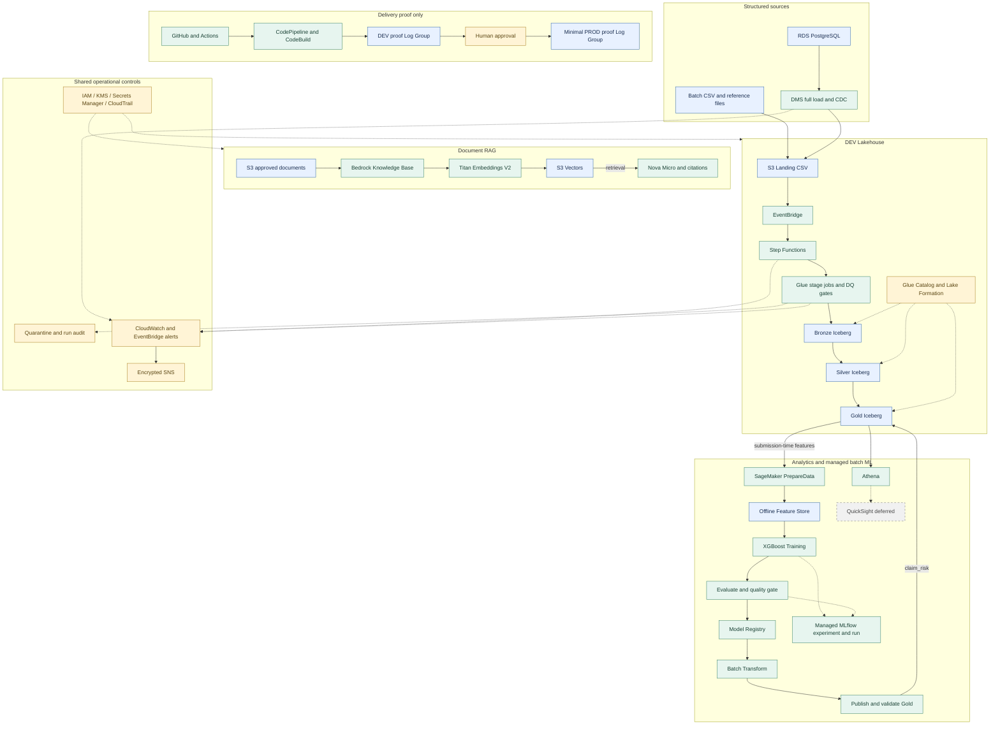

# V6B 最终架构

本图描述 V1–V6B 已验收实现边界。结构化数据平台和 V6/V6B 托管 ML 平台运行于 DEV；完整 PROD 平台未部署。实线表示数据或执行路径，虚线表示共享治理、监控或证据追踪。

Bronze、Silver、Gold 均为 S3 上的 Iceberg 表，由 Glue 分阶段处理。图中的层间箭头表示处理依赖；每一步仍由 Glue 执行。Batch 理赔与 PostgreSQL 理赔保留不同事实表，外部文件不会覆盖 OLTP 事实来源。

ML 正式特征排除赔付金额、最终状态等事后字段。SageMaker Pipeline 是编排器：准备数据、写入并读回离线 Feature Store、训练、评估、质量门禁、注册模型、批量推理并发布 Gold `claim_risk`。Model Registry 承担模型版本与人工状态治理；Batch Transform 承担推理；Managed MLflow 仅追踪参数、指标、制品和 lineage，不编排作业。没有实时 endpoint，MLflow 不使用时保持停止。验收使用日期早于理赔提交的单一参考快照；未实现多版本参考数据的 as-of join。RAG 的实际输入是独立的获批文档：没有已实现的 Gold → Knowledge Base 自动同步。

Delivery 子图仅表示独立 proof stack 的发布顺序；它不连接或部署完整 DEV Lakehouse。人工审批后的 PROD 范围仍只有一个 proof 日志组。

成本边界：AWS FREE 计划保持不变；QuickSight 未订阅；无持久 SageMaker endpoint、OpenSearch 或替代流式系统。离线 Feature Store 不启用在线服务。Small MLflow 首次验证误运行约 14 小时 52 分钟、估算约 USD 9.55，已停止；后续 DEV 策略是不使用即停止并明确限定运行窗口。Streaming 自 V2 起退役，不是等待启用的活动组件。既有 DMS 任务失败状态与保留历史重放证明需分开理解；SNS 已验证服务投递，但未配置人工订阅。

交付控制面见 [CI/CD 与安全边界](cicd-security.md)，处理语义见 [数据流](data-flow.md)。实现及验证依据：[V5 完成评审](../releases/v5/v5-completion-review.md)、[V6 Pipeline](sagemaker-managed-pipeline.md)、[V6B 验收](../releases/v6b/v6b-completion-review.md)、[RAG](../releases/v1/v1-rag.md)。历史评审中“等待验收”的文字记录其当时状态，最终版本以验收标签为准。
